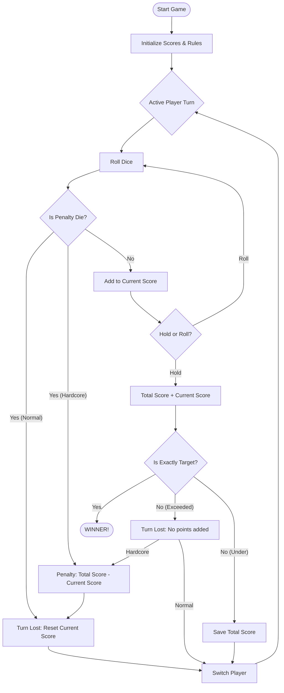

# Lumina Dice 🎲

**Lumina Dice** is a premium, high-stakes risk-strategy dice game built with modern web technologies and a stunning glassmorphism design. Challenge your luck, manage your risk, and be the first to reach a custom target score—but be careful not to roll the penalty die!

## 🌟 Features

- **Premium Glassmorphism UI:** A sleek, dark-themed interface with blurred backdrops and vibrant neon accents.
- **Custom Game Configuration:** Define your own winning target and penalty dice value.
- **Hardcore Mode:** High stakes! Rolling a penalty die or exceeding the target doesn't just end your turn—it deducts your accumulated points from your total bank.
- **Exact Win Condition:** Strategy is key. You must land exactly on the target score to win.
- **Fully Responsive:** Play on any device, from desktop to mobile.
- **Contextual Rules:** Quickly view rules via the Info icon or reconfigure the game using the New Game button.

## 🕹️ How to Play

1. **Configure:** Set your Target Score (default 100) and Penalty Die (default 6). Choose your mode (Normal or Hardcore).
2. **Roll:** Click "Roll Dice" to accumulate points.
3. **Avoid Penalties:**
   - In **Normal Mode**, rolling a 1 or the Penalty Die resets your *current* turn score and switches players.
   - In **Hardcore Mode**, rolling a Penalty Die *deducts* your current turn's points from your *total* score.
4. **Hold:** Click "Hold" to add your current turn points to your total bank.
5. **Win:** Be the first to reach the target score **exactly**. If you exceed it, you miss your turn (and face a penalty in Hardcore mode).

## 📊 Game Logic Flowchart

## 🛠️ Built With

- **HTML5:** Semantic structure and SEO optimization.
- **CSS3:** Custom properties, Flexbox/Grid, and Backdrop Filters for the glassmorphism effect.
- **JavaScript:** Pure Vanilla JS game engine logic.
- **SVG:** Scalable vector graphics for icons.

## 🚀 Optimization & SEO

Lumina Dice is optimized for fast performance and search engine visibility:
- **Meta Tags:** Comprehensive description and keyword mapping.
- **Accessibility:** ARIA roles and keyboard navigation (Esc to close modals).
- **Mobile First:** Responsive breakpoints for a seamless mobile experience.

---

Created by [LAWAL](https://lawaloyinlola.com)
